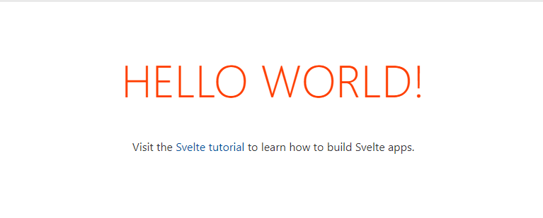

As highlighted earlier, components must be converted to HTML, CSS and JavaScript before they can be run in the browser. Svelte provides a template you can use to scaffold your projects which includes a build process.

## Creating your first project

Let's create your first Svelte project by using the template provided by Svelte. You will use [degit](https://github.com/Rich-Harris/degit#readme), a utility which copies GitHub repositories. You will run the command with [npx](https://docs.npmjs.com/cli/v7/commands/npx), which allows you to run NPM executables without installing them locally.

1. Open a command or terminal window
1. Execute the following command to scaffold the project:

    ```bash
    npx degit sveltejs/template dog-shelter
    ```

1. If prompted to download *degit*, select *Y* or *yes*
1. Once the scaffold is complete, navigate to the folder and install the necessary packages by running the following:

    ```bash
    cd dog-shelter
    npm install
    ```

1. Finally, open the project in Visual Studio Code by running the following:

    ```bash
    code .
    ```

## Exploring the scaffolded project

As with any template, there are files you will use all the time, files you will use once in a while, and files you'll either never use or delete. This is natural, as there is no "one-size-fits-all" for project templates. However, Svelte does use a relatively minimal scaffold. Let's explore the overall structure.

| Filename(s)                        | Description                                                                 |
| ---------------------------------- | --------------------------------------------------------------------------- |
| .gitignore                         | [gitignore](https://git-scm.com/docs/gitignore) file                        |
| package.json and package-lock.json | NPM package management files                                                |
| rollup.config.js                   | Svelte configuration file used to add packages or functionality             |
| README.md                          | Additional documentation                                                    |
| /src/main.js                       | Bootstrap file to load main component                                       |
| /src/App.svelte                    | Main component and entry point to your Svelte application                   |
| /public/*.*                        | public contains all files which are not modified by the build process, such as HTML or CSS files, images, or other scripts |
| /scripts/setupTypeScript.js        | Script to enable TypeScript for the project                                 |

## Run the project

*package.json* includes a *dev* script, which is the conventional script for launching the project in a developer mode. Running this script will build the project and start a local server. The process will also watch for file changes, and refresh the page automatically as updates occur.

Let's start the dev server:

1. Inside Visual Studio Code, open a new integrated terminal by selecting *Terminal* > *New Terminal*
1. In the new terminal window, run the following to launch the dev server:

    ```bash
    npm run dev
    ```

1. Open a browser, and navigate to [http://localhost:5000](http://localhost:5000)
1. You'll be presented with the Hello World from Svelte.

    
