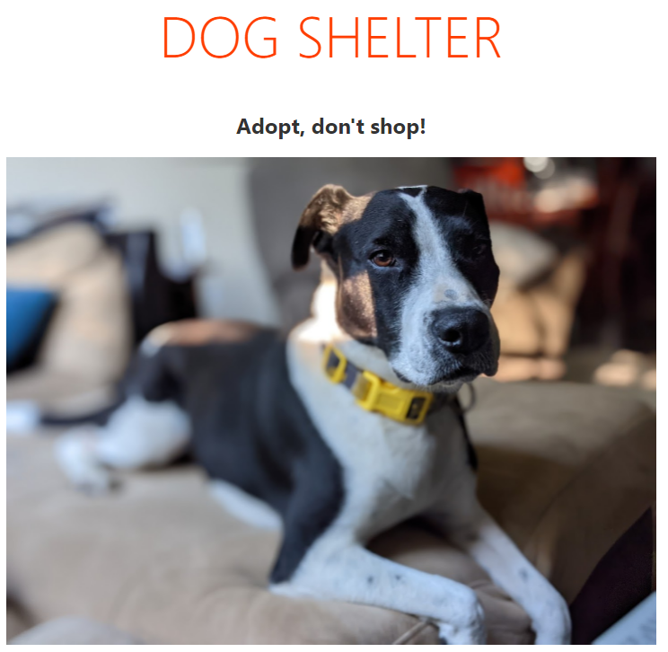

You will typically find after scaffolding a project from a template you will heavily modify the auto-generated files, sometimes even completely replacing them. Because the Svelte template is rather lightweight you will find you can keep the bulk of what's been provided. Let's explore how you would begin modifying files to add your own code.

You will add the necessary code to display an image of a dog. You will create a JavaScript object with the information to display the image, and the HTML to render it. You can also [peruse the solution](link needed).

## Update main.js

Because our newly updated component will not use the `name` prop, let's remove it from *main.js*.

1. Inside Visual Studio Code, open *src/main.js*.
1. Remove lines 5-7 from the file. The *complete* updated file will now contain the following:

```javascript
import App from './App.svelte';

const app = new App({
    target: document.body,
});

export default app;
```

> [!NOTE] If you return to the browser you may notice the page has updated to say "Hello, undefined".

## Download the picture

1. Inside *public*, create a new folder named *images*.
1. Download the [dog image](./dog.jpg) and save the file to the *images* folder you created in the prior step.

## Update App.svelte

Let's update App.svelte to add the desired functionality. You will create an object which contains the information about the picture. Then you will add the appropriate HTML to display the image using the object.

1. Inside Visual Studio Code, open */src/app.svelte*
1. Replace the contents of `script` with the following to create the object with the information to display :

    ```javascript
    let dogImage = {
        src: 'images/dog.jpg',
        alt: 'Picture of a black and white dog',
        tagline: 'Adopt, don\'t shop!'
    }
    ```

1. Replace the contents of `main` with the following

    ```html
    <h1>Dog Shelter</h1>
    <h2>{dogImage.tagline}</h2>
    
    ```

## View the results

With the files updated, it's time to see the output!

1. Save all files by selecting *File* > *Save all*.
1. View the existing terminal in Visual Studio Code by selecting *View* > *Terminal*.
1. You should notice an updated message indicating "created public/build/bundle.js". If your server is not currently running, you can restart it by running `npm run dev`
1. Return to your browser or navigate to [http://localhost:5000](http://localhost:5000).
1. Your updated page now appears

    

## Congratulations

You have now created your first Svelte application.
